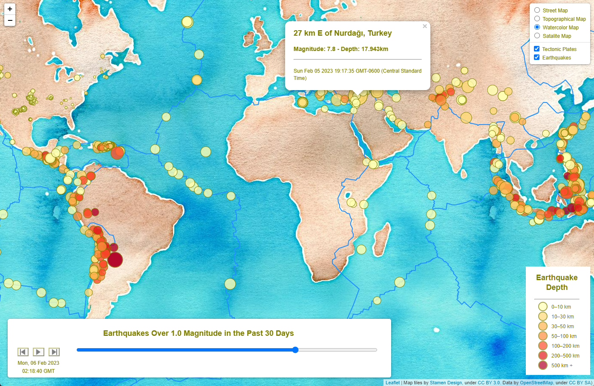

# US Geological Survey Earthquake Visualization
Visualizing US Geological Survey data to better educate the public and other government organizations on issues facing our planet
- - -

- - -
## Project Structure
### Completed Map Dashboard can be found [HERE](https://andcetera.github.io/leaflet-challenge/)
### Files:
- [logic.js](static/js/logic.js) - The main Javascript code for this project is housed in the [static/js](static/js/) path along with the leaflet.timeline file required for the animations
- [index.html](index.html) can be found at the root, and [style.css](static/css/style.css) can be found in the static/css path for reference
- The [Images](Images/) folder contains all images used in this README document

- - -
## Background
The United States Geological Survey, or USGS for short, is responsible for providing scientific data about natural hazards, the health of our ecosystems and environment, and the impacts of climate and land-use change. Their scientists develop new methods and tools to supply timely, relevant, and useful information about the Earth and its processes.

The USGS is interested in building a new set of tools that will allow them to visualize their earthquake data. They collect a massive amount of data from all over the world each day, but they lack a meaningful way of displaying it. In this challenge, you have been tasked with developing a way to visualize USGS data that will allow them to better educate the public and other government organizations (and hopefully secure more funding) on issues facing our planet.

- - -
## Instructions
The instructions for this activity are broken into two parts:

- Part 1: Create the Earthquake Visualization

- Part 2: Gather and Plot More Data (Optional - no extra points)

## Part 1: Create the Earthquake Visualization
  

Your first task is to visualize an earthquake dataset. Complete the following steps:

1. Get your dataset. To do so, follow these steps:

    - The USGS provides earthquake data in a number of different formats, updated every 5 minutes. Visit the [USGS GeoJSON Feed](https://earthquake.usgs.gov/earthquakes/feed/v1.0/geojson.php) page and choose a dataset to visualize. The following image is an example screenshot of what appears when you visit this link:  

  

2. Import and visualize the data by doing the following:

    - Using Leaflet, create a map that plots all the earthquakes from your dataset based on their longitude and latitude.

        - Your data markers should reflect the magnitude of the earthquake by their size and the depth of the earthquake by color. Earthquakes with higher magnitudes should appear larger, and earthquakes with greater depth should appear darker in color.

    - Include popups that provide additional information about each earthquake.

    - Create a legend that will provide context for your map data.

    - Your visualization should look something like the preceding map.

## Part 2: Gather and Plot More Data
Plot a second dataset on your map to illustrate the relationship between tectonic plates and seismic activity. You will need to pull in this dataset and visualize it alongside your original data. 

This part is completely optional; you can complete this part as a way to challenge yourself and boost your new skills.

The following image is an example screenshot of what you should produce:

   

Perform the following tasks:

- Plot the tectonic plates dataset on the map in addition to the earthquakes.

- Add other base maps to choose from.

- Put each dataset into separate overlays that can be turned on and off independently.

- Add layer controls to your map.

- Add animations and a timeline as shown below:

- - -
## References
Dataset created by [the United States Geological Survey](https://earthquake.usgs.gov/earthquakes/feed/v1.0/geojson.php). Tectonic plate dataset can be found on [GitHub](https://github.com/fraxen/tectonicplates). Leaflet Timeline Controls found [here](https://github.com/skeate/Leaflet.timeline).